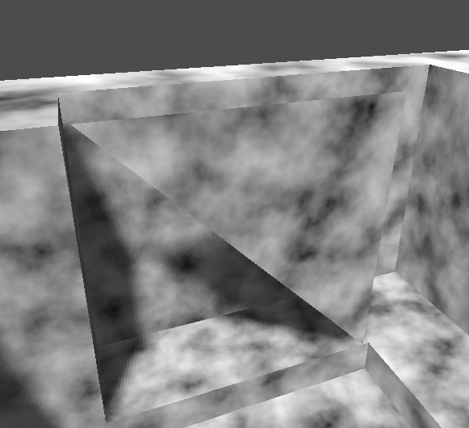
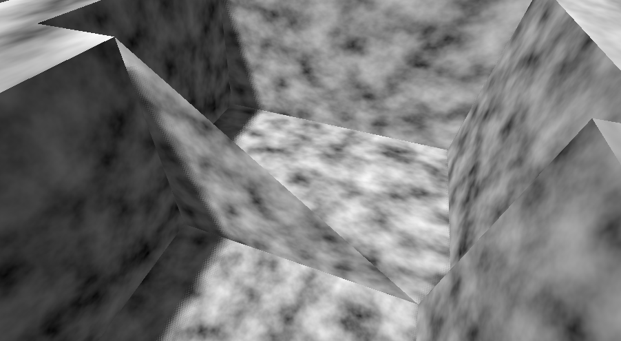
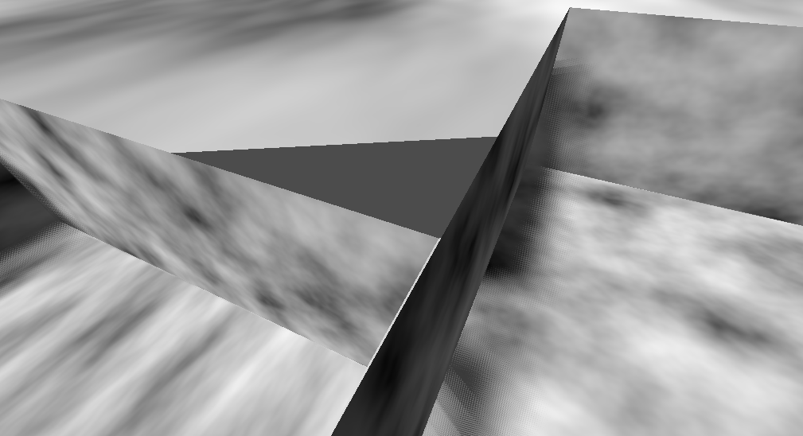

For [Subtracting two CSG box nodes from a box can generate a floating triangle godotengine/godot#86567](https://github.com/godotengine/godot/issues/86567)

## TwoCSGBox.tscn

## Coplanar.tscn

## Missing.tscn

